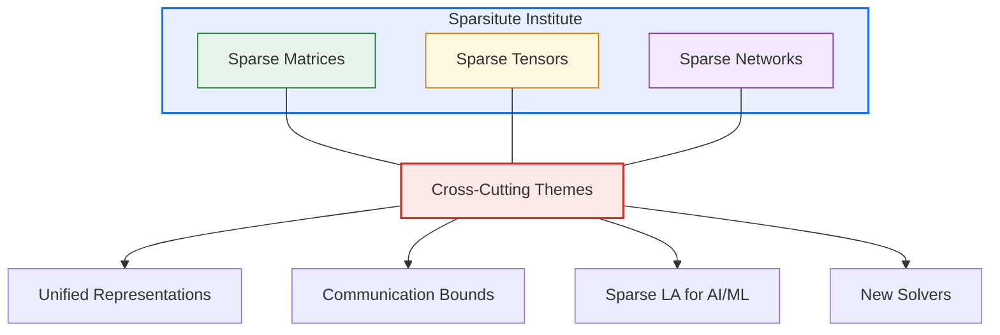

## The Sparsity Opportunity

Modern scientific computing faces a fundamental inefficiency: most large-scale computations involve matrices, tensors, and graphs where the vast majority of elements are zero. Without algorithms designed for sparsity, exascale systems waste enormous compute cycles on zeros—multiplying by zero, storing zeros, communicating zeros. **Sparsitute exists to close this gap.**

[Sparsitute](https://sparsitute.lbl.gov/) is a DOE-funded Mathematical Multifaceted Integrated Capability Center (MMICC), operational from 2022–2027 under the Advanced Scientific Computing Research (ASCR) program. It brings together leading researchers across national laboratories and universities to develop the mathematical foundations and software for sparse computations.

## Three Pillars of Sparsity

The institute's research agenda is organized around three interconnected pillars—unified by the observation that all such structures can be represented with asymptotically fewer than N² nonzero elements.

### Sparse Matrix Pillar

Goals include developing unified matrix representations and associated primitives, new algebraic solvers and preconditioners targeting numerical optimization, sparse linear algebra algorithms to accelerate AI/ML training, and communication-efficient algorithms informed by lower-bound analysis.

### Sparse Tensor Pillar

Targets new algorithms for tensor decomposition and completion, solvers for tensor-structured equations, and optimized computational kernels underlying scalable sparse tensor algorithms.

### Sparse Network Pillar

Advances understanding of problems that do not reduce to matrices and tensors over standard fields, where such reductions cause inefficient runtime or parallelization, where temporal data require specialized approaches, and where model flexibility allows inducing sparsity in ML models.

## My Role

As Co-PI, I contribute to communication-avoiding algorithms for sparse solvers, sparse tensor factorization methods, and graph algorithm optimization—connecting multiple pillars through cross-cutting algorithmic themes.

## Impact

Sparsitute's work directly feeds into production software (SuperLU_DIST, ArborX) and enables scientific applications from climate modeling to drug discovery. The institute has already produced new theoretical bounds, practical algorithms achieving 25%+ speedups, and community standards for sparse linear algebra interfaces.

**Learn more:** [sparsitute.lbl.gov](https://sparsitute.lbl.gov/)
