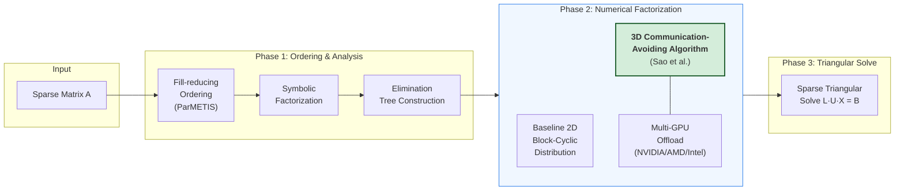

## The Sparse Direct Solver Challenge

Sparse direct solvers are the workhorses of scientific computing—solving the linear systems that arise in structural mechanics, circuit simulation, and computational fluid dynamics. But as systems scale to thousands of processors, **communication becomes the bottleneck**: traditional 2D algorithms spend more time exchanging data than computing.

[SuperLU_DIST](https://github.com/xiaoyeli/superlu_dist) is a widely used, open-source library for solving large sparse linear systems A·X = B using Gaussian elimination with static pivoting (GESP). It combines the numerical stability of partial pivoting with the scalability of no-pivoting approaches.

## The 3D Communication-Avoiding Algorithm

My key contribution is the **communication-avoiding 3D factorization algorithm**, which fundamentally restructures how sparse LU factorization distributes work across processors.

The algorithm uses a three-dimensional MPI process grid, exploits elimination tree parallelism, and trades increased memory for dramatically reduced per-process communication. Released as the **recommended code path starting with Version 9.0.0**.

## Performance Results

| Configuration | Planar Graphs | Non-Planar Graphs |
|--------------|---------------|-------------------|
| 24,000 cores (Cray XC30) | **27× speedup** | **3.3× speedup** |
| 4,096 nodes + GPUs (Cray XK7) | **24× speedup** | **3.5× speedup** |

For a planar graph with *n* vertices, the 3D algorithm achieves:
- Communication volume reduction by O(√log n)
- Latency reduction by O(log n)

## Additional Contributions

- **HALO (Highly Asynchronous Lazy Offload)** — CPU–GPU co-processing scheme that reduces host-device communication
- **Multi-GPU support** — NVIDIA, AMD, and Intel GPUs
- **Mixed-precision routines** — Single-precision factorization with double-precision iterative refinement
- **3D Sparse Triangular Solve** — Communication-avoiding triangular solver using one-sided MPI

## Key Publications

- P. Sao, X.S. Li, R. Vuduc. *A communication-avoiding 3D algorithm for sparse LU factorization on heterogeneous systems.* JPDC, 2019.
- P. Sao, X.S. Li, R. Vuduc. *A communication-avoiding 3D LU factorization algorithm for sparse matrices.* IPDPS 2018.
- X.S. Li, P. Lin, Y. Liu, P. Sao. *Newly released capabilities in the distributed-memory SuperLU sparse direct solver.* ACM TOMS, 2023.

**Code:** [github.com/xiaoyeli/superlu_dist](https://github.com/xiaoyeli/superlu_dist)
