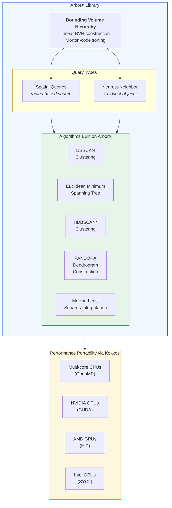

## The Spatial Search Problem

Many scientific applications—from cosmology simulations to wind farm modeling—need to answer geometric queries at massive scale: *Which particles are within distance r? What are the k nearest neighbors?* Traditional spatial data structures don't map well to GPUs, where irregular memory access patterns kill performance.

[ArborX](https://github.com/arborx/ArborX) is an open-source C++ library providing performance-portable algorithms for geometric search on modern supercomputing architectures. Developed as part of the Exascale Computing Project (ECP), it uses Kokkos for device-independent parallelism, enabling efficient execution across CPUs and GPUs from multiple vendors using a single codebase.

## Architecture

At its core, ArborX uses a linear bounding volume hierarchy (BVH) for low construction cost and high-quality spatial indexing. It supports both spatial queries and nearest-neighbor queries, each requiring fundamentally different tree traversal strategies.

## My Contributions

### Single-Tree Borůvka EMST (ICPP 2022)

Computing the Euclidean Minimum Spanning Tree on GPUs is challenging due to complex branching, data dependencies, and load imbalances. Our single-tree Borůvka algorithm addresses these challenges through careful work distribution and ArborX's spatial primitives.

### PANDORA: Parallel Dendrogram Construction (ICPP 2024)

Single-linkage clustering requires building a dendrogram—a hierarchical tree of cluster merges. PANDORA constructs this structure in parallel on GPUs, leveraging ArborX's nearest-neighbor queries to achieve scalable hierarchical clustering.

### DBSCAN for Cosmology (ExaSky)

The DBSCAN clustering algorithm we developed in ArborX performs **15× better on a single GPU** than the multithreaded CPU version on a full Summit node, directly benefiting the ECP ExaSky cosmology project.

## Impact

ArborX is published in ACM TOMS (2020) and is an integral component of xSDK and the broader ECP software ecosystem. Applications include:
- Computational cosmology (halo finding)
- Multiphysics data transfer
- Computational mechanics
- Wind farm simulations

**Code:** [github.com/arborx/ArborX](https://github.com/arborx/ArborX)
