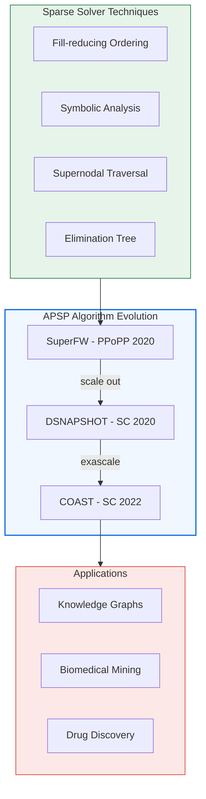

## From Text to Discovery

Biomedical literature doubles every few years. Hidden within millions of papers are connections that no single researcher could find: drug A treats disease X through pathway Y, but these facts span decades of publications across disciplines. **Knowledge graph analytics makes these connections computable.**

This research develops scalable graph algorithms—particularly all-pairs shortest paths (APSP)—that power relationship discovery across massive scholarly corpora.

## Algorithm Evolution

The core insight: the algebraic equivalence between Floyd-Warshall and Gaussian elimination enables importing sparse direct solver techniques to graph shortest-path computation.

### SuperFW: Supernodal APSP (PPoPP 2020)

Applies sparse Cholesky-style techniques to APSP. Vertices with similar adjacency structure are grouped into supernodes, enabling blocked operations that improve cache locality. Achieves **50× speedup** over baselines for several graph classes.

### DSNAPSHOT: 136 Petaflop/s (SC 2020)

GPU-accelerated, distributed-memory Floyd-Warshall on Summit. Operating in the tropical semiring (min-plus algebra), achieved **136 petaflop/s** at 90% parallel efficiency on 4,096 nodes (24,576 GPUs).

### COAST: First Exaflop Graph Algorithm (SC 2022)

Extended to Frontier's AMD GPUs, achieving **1.004 exaflop/s**—the first graph AI algorithm to surpass one exaflop. **Gordon Bell Prize Finalist.**

## Biomedical Applications

Applied to COVID-19 Open Research Dataset (CORD-19) and the SPOKE biomedical knowledge network for:

- Drug repurposing candidates
- Treatment pathway discovery
- Cross-discipline hypothesis generation

## Technology Transfer

**US Patent 12,417,246**: _Knowledge graph analytics kernels in high performance computing_ (2025)

The algorithms developed here have been patented and transitioned to production use, enabling real-world biomedical discovery.

## Key Publications

- P. Sao, R. Kannan, P. Gera, R. Vuduc. _A Supernodal All-Pairs Shortest Path Algorithm._ PPoPP 2020. **SIAM PP22 Best Paper Prize** .
- R. Kannan, P. Sao, H. Lu, et al. _Scalable Knowledge Graph Analytics at 136 Petaflop/s._ SC 2020. **Gordon Bell Finalist** .
- R. Kannan, P. Sao, H. Lu, et al. _Exaflops Biomedical Knowledge Graph Analytics._ SC 2022. **Gordon Bell Finalist** .
