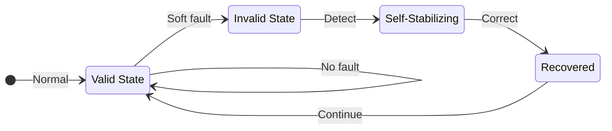

## The Exascale Reliability Problem

As HPC systems scale toward exascale, the probability of hardware faults—particularly transient soft faults like bit flips—increases significantly. A system with millions of components running for hours will experience faults. Traditional checkpoint-restart is expensive; **can algorithms themselves be designed to tolerate faults?**

This research develops **self-stabilizing algorithms**: algorithms that, regardless of whether they start from a valid or corrupted state, are guaranteed to converge to a correct state after a finite number of steps.

## Self-Stabilization Framework

The key insight: by carefully analyzing what constitutes a valid state during algorithm execution, we can design verification and correction procedures that detect and fix corruption without full restart.

## Self-Stabilizing Connected Components

For the fundamental problem of computing connected components:

- Developed fault-tolerant variant of label propagation
- Comprehensive analysis of valid vs. invalid states
- Adds only O(V log V) computation and O(V) storage over conventional algorithm
- **More resilient than triple modular redundancy (TMR) in 80% of test cases**

## Self-Stabilizing Iterative Solvers

Extended self-stabilization to numerical linear algebra:

- Iterative solvers that detect soft faults during computation
- Recovery without losing convergence progress
- Applicable to CG, GMRES, and other Krylov methods

## Resilience Design Patterns

Co-authored a comprehensive technical report documenting resilience design patterns for extreme-scale systems—providing a structured taxonomy for building fault-tolerant HPC applications.

## Why This Matters

| Approach                  | Overhead   | Recovery Time       | Coverage        |
| ------------------------- | ---------- | ------------------- | --------------- |
| Checkpoint-Restart        | High (I/O) | Minutes             | Complete        |
| Triple Modular Redundancy | 3× compute | Immediate           | Hardware faults |
| **Self-Stabilization**    | Low (O(V)) | Algorithm-dependent | Soft faults     |

Self-stabilization provides a middle ground: low overhead with automatic recovery for the most common fault types at scale.

## Key Publications

- P. Sao, C. Engelmann, S. Eswar, O. Green, R. Vuduc. _Self-stabilizing Connected Components._ FTXS 2019 .
- P. Sao, R. Vuduc. _Self-stabilizing Iterative Solvers._ ScalA Workshop, SC 2013 .
- P. Sao, O. Green, C. Jain, R. Vuduc. _A Self-Correcting Connected Components Algorithm._ FTXS 2016 .
- C. Engelmann, R. Ashraf, S. Hukerikar, M. Kumar, P. Sao. _Resilience Design Patterns: A Structured Approach to Resilience at Extreme Scale._ ORNL Tech Report, 2022 .
