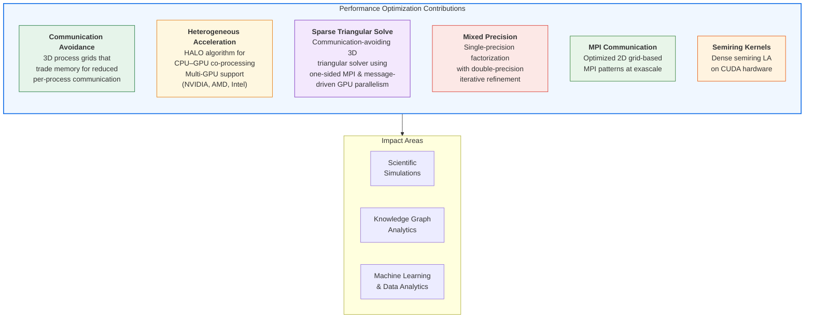

## The Communication Bottleneck

Across sparse solvers, graph algorithms, and tensor computations, the same fundamental challenge emerges: **communication dominates runtime at scale.** Modern supercomputers have abundant floating-point capability, but moving data between nodes, between CPU and GPU, or even between cache levels remains expensive.

This research thread develops cross-cutting techniques for reducing communication in distributed HPC applications.

## Communication-Avoiding 3D Algorithms

The central theme: arranging processes in a 3D grid and selectively replicating data yields asymptotic communication reductions.

- **3D Sparse LU Factorization**: O(√log n) volume and O(log n) latency reduction for planar graphs
- **3D Sparse Triangular Solve**: One-sided MPI with message-driven GPU parallelism
- **3D APSP**: Extended to distributed graph analytics

## Heterogeneous Architecture Support

### HALO: Highly Asynchronous Lazy Offload

Efficient CPU–GPU co-processing by using data replication strategies that reduce host-device communication. Mirrors the philosophy of 3D factorization applied to heterogeneous nodes.

### Multi-Vendor GPU Support

Developed unified code paths supporting:
- NVIDIA GPUs (CUDA)
- AMD GPUs (HIP/ROCm)
- Intel GPUs (SYCL/oneAPI)

## Exascale MPI Optimization

Work on optimizing 2D grid-based MPI communication patterns at exascale (EuroMPI 2023), addressing bottlenecks in data exchange patterns common to both linear algebra and graph algorithms.

## Community Standards

Co-authored the **Interface for Sparse Linear Algebra Operations** (2024), a community standard defining portable APIs for sparse LA across vendors and implementations. This 26-author effort establishes common interfaces that enable algorithm-library interoperability.

## Key Publications

- P. Sao, R. Kannan, X.S. Li, R. Vuduc. *A communication-avoiding 3D sparse triangular solver.* ICS 2019.
- Y. Liu, N. Ding, P. Sao, S. Williams, X.S. Li. *Unified Communication Optimization Strategies for Sparse Triangular Solver on CPU and GPU Clusters.* SC 2023.
- H. Lu, P. Sao, M. Matheson, R. Kannan, F. Wang, T. Potok. *Optimizing Communication in 2D Grid-Based MPI Applications at Exascale.* EuroMPI 2023.
- V. Thakkar, R. Kannan, P. Sao, et al. *Dense semiring linear algebra on modern CUDA hardware.* SIAM CSE 2021.
- A. Abdelfattah, ..., P. Sao, et al. *Interface for sparse linear algebra operations.* arXiv:2411.13259, 2024.

## Connection to Other Projects

These optimization techniques are applied across:
- **SuperLU_DIST**: 3D factorization and triangular solve
- **Knowledge Graphs**: DSNAPSHOT and COAST communication patterns
- **ArborX**: Distributed spatial queries
- **Sparsitute**: Communication lower-bound theory
